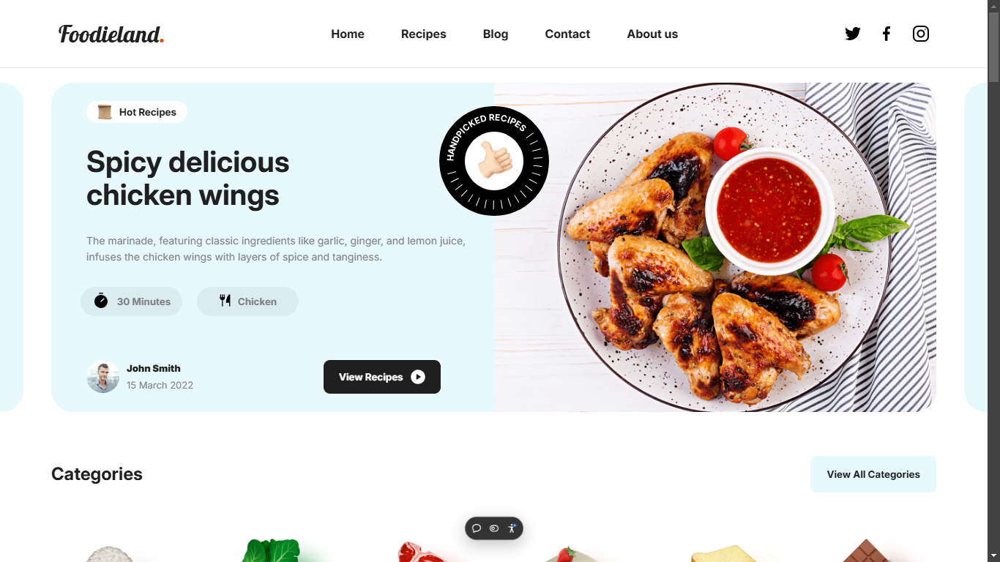

# 
Foodieland.

To support me, give star⭐ to this repository please.
I appreciate your support in advance. ❤

<section width="100%" display="flex" align="center" gap="2rem">
  
  
</section>

### 
🔧Technologies:

  

  

--------------------------------------------------------------

  

You can visit and explore in the <a href="https://foodieland-sass-project.vercel.app/" target="_blank">Foodieland.</a>

📌Please Use VPN to see the site.

